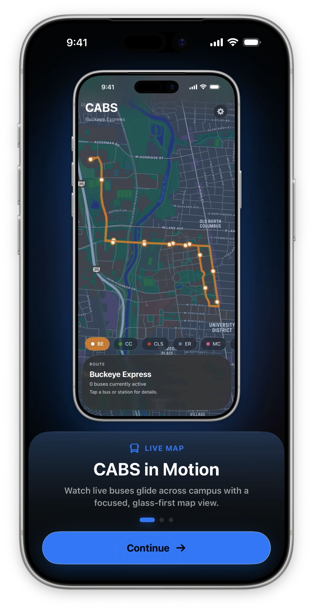
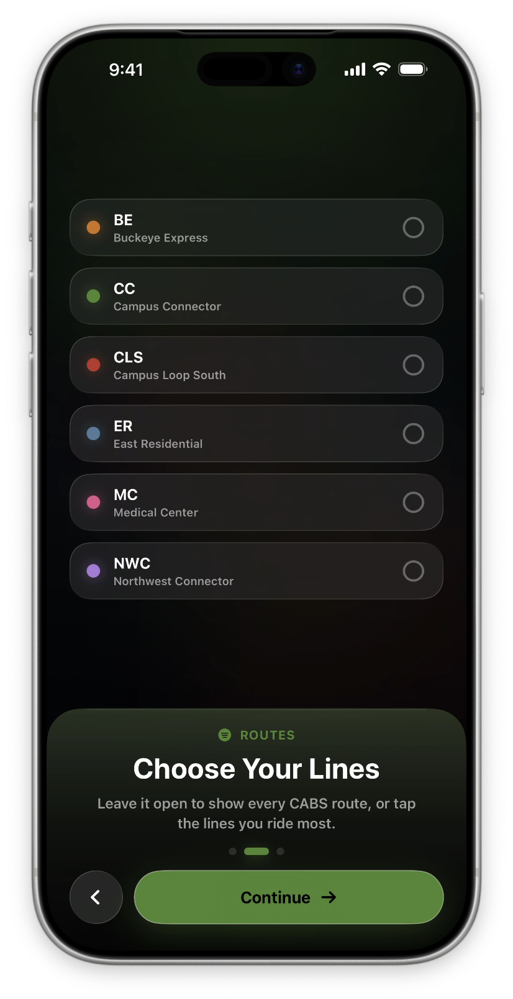
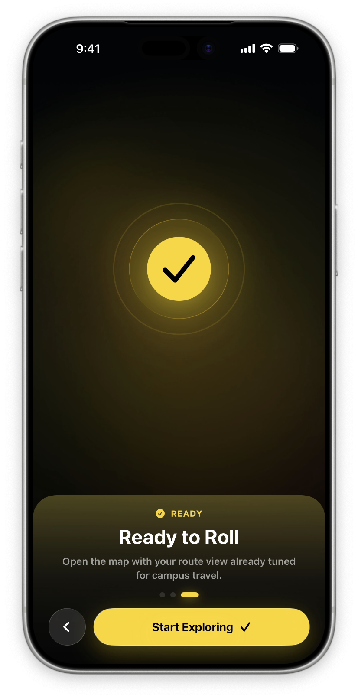
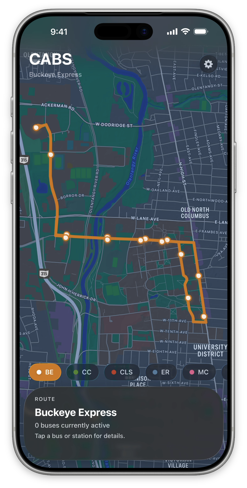
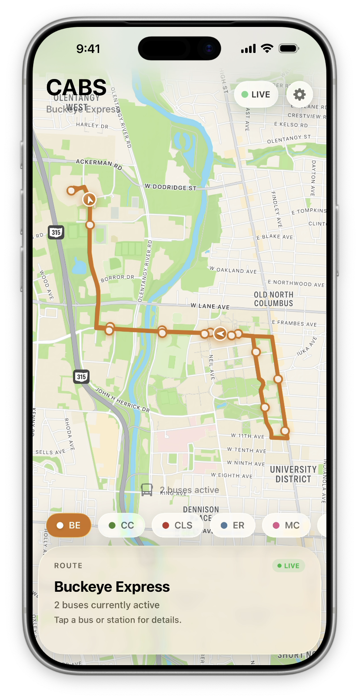
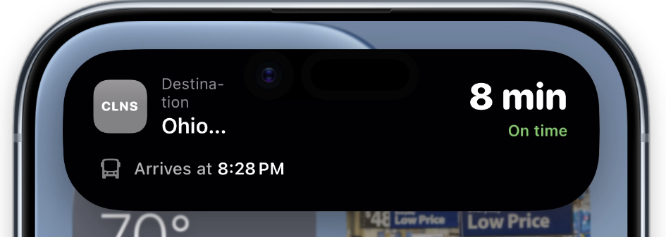
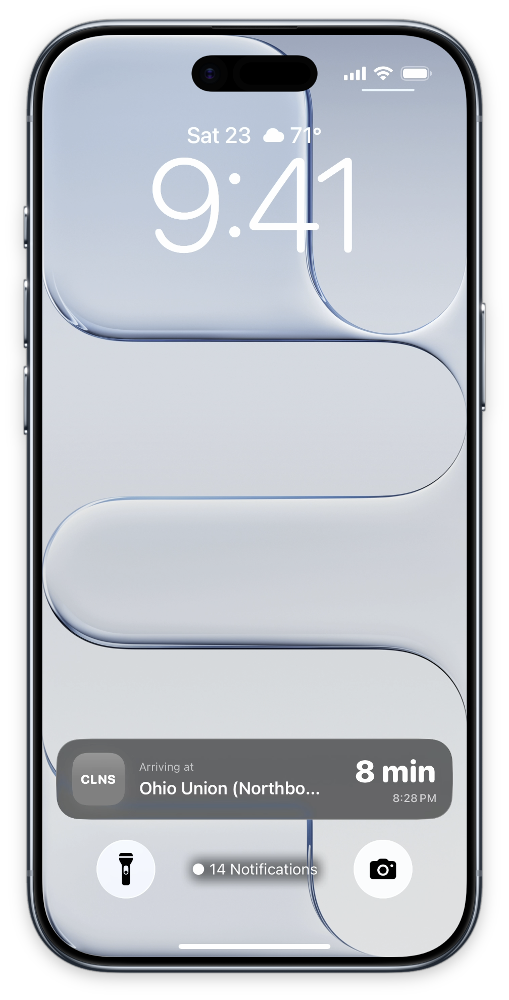
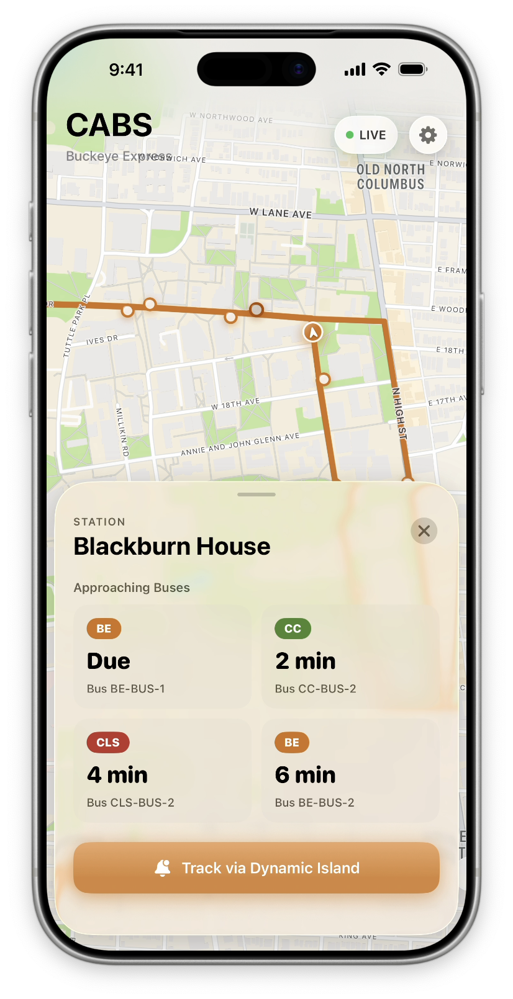

<div align="center">
  <h1>CABSFlight</h1>
  <p><b>An experimental, fluid transit interface for the OSU CABS system.</b></p>

  <p>
    
    
    
  </p>
</div>

> **Disclaimer:** This is a personal passion project created purely out of interest in UI/UX design and iOS development. It is **not** affiliated with, endorsed by, or connected to The Ohio State University or the official Campus Area Bus Service (CABS).

## Overview

CABSFlight is an unofficial, real-time campus transit tracker designed with a relentless focus on aesthetics and user experience.

The project explores how modern Apple design languages—specifically the "Liquid Glass" aesthetic—can transform a standard utility app into a premium, tactile experience. It aims to solve the friction of inaccurate bus ETAs while delivering an uncompromising, fluid interface.

The current prototype already runs an end-to-end tracking experience against a self-contained local simulation: live bus movement, stop-aware ETA prediction, Live Activities, and a Dynamic Island integration, all wired to the UI without a backend dependency.

---

## Recent Updates

A summary of where the project has moved since the initial prototype:

* **Live Activity + Dynamic Island** — Compact, Expanded, and Lock Screen presentations for live bus arrival tracking.
* **Local simulation engine** — `CABSMockEngine` simulates vehicle movement, ETAs, and stop predictions, decoupling the entire UI layer from the backend during development.
* **Activity lifecycle management** — `CABSLiveActivityManager` starts, updates, and ends Live Activities from the bottom drawer / tracking flow.
* **Route color system** — `BusBadgeView` + `CABSColors` give each route a consistent identity across the app and Live Activities.
* **Map stability** — Fixed camera race conditions and locked the map viewport to route stops to prevent extreme zoom-out, with broader UI stabilization for folded loops like the WMC route.
* **Map layer polish** — Tuned stop-marker size and shape in `LiquidMapLayer` for clearer at-a-glance readability.

---

## Showcase

*The screenshots below represent current UI/UX prototypes running against the local simulation engine.*

<div align="center">
  <table>
    <tr>
      <td align="center"><b>Onboarding Experience</b></td>
      <td align="center"><b>Route Picker</b></td>
      <td align="center"><b>Onboarding Complete</b></td>
    </tr>
    <tr>
      <td></td>
      <td></td>
      <td></td>
    </tr>
    <tr>
      <td align="center"><b>In-App Interface</b></td>
      <td align="center"><b>Live Map Overview</b></td>
      <td align="center"></td>
    </tr>
    <tr>
      <td></td>
      <td></td>
      <td></td>
    </tr>
    <tr>
      <td align="center"><b>Dynamic Island (Expanded / Compact)</b></td>
      <td align="center"><b>Lock Screen Live Activity</b></td>
      <td align="center"><b>Live Bus Tracking</b></td>
    </tr>
    <tr>
      <td></td>
      <td></td>
      <td></td>
    </tr>
  </table>
</div>

---

## Design & Experience Focus

Rather than focusing solely on backend data, this project is an exercise in frontend interaction design:

* **Liquid Glass Aesthetic:** Utilizing modern iOS materials to create a sense of depth. Floating panels and route chips realistically refract the underlying map, making the UI feel like physical glass.
* **Algorithmic User Experience:** A custom prediction model factors in stop dwell times and campus traffic, preventing the infinite "1 minute away" problem when buses are holding at terminals.
* **Physics-Based Interactions:** Seamless state transitions and tactile feedback so the interface feels organic and responsive to touch.
* **Glanceable Live Activities:** Bringing the tracking experience out of the app and onto the Lock Screen and Dynamic Island.

---

## Development Status

This project is in **active development**. The prototype already includes Live Activities and Dynamic Island (validated against a local mock environment), and map interaction and stability are being iterated on continuously (camera race-condition fixes, viewport locking, UI stabilization).

**Done / In Progress**

- [x] Initial MapKit setup and custom map styling
- [x] "Liquid Glass" UI architecture and layout
- [x] Onboarding flow with Mesh Gradient backgrounds
- [x] **Local simulation engine** (`CABSMockEngine`) for ETAs and vehicle state
- [x] **Live Activities & Dynamic Island** — Compact / Expanded / Lock Screen presentations
- [x] **Route color system** (`BusBadgeView` + `CABSColors`)
- [x] **Map robustness** — camera race-condition fixes and viewport locking
- [~] **Predictive scheduling** — stop-aware ETA holding, with glanceable itineraries in progress

**Planned**

- [ ] **Live data integration** — swap the mock engine for the real CABS endpoint (the public model shape is already aligned)
- [ ] **Multi-Route Orchestration:** Seamless UX flows for complex transfers and multi-bus commutes.
- [ ] **Smooth Movement Interpolation:** Physics-based vehicle animations to eliminate jarring map-marker jumps.

---

## Project Structure

```
CABSFlight/
├── CABSFlight/                  # Main app target
│   ├── CABSMockEngine.swift     # Self-contained local simulation (ETAs, vehicle state)
│   ├── LiquidGlassView.swift    # Liquid Glass map UI + LiquidMapLayer
│   ├── CABSColors.swift         # Shared route color palette
│   └── ...
├── CABSFlightWidget/            # Live Activity / Dynamic Island target
│   ├── CABSFlightLiveActivity.swift   # Live Activity entry point & presentations
│   ├── BusBadgeView.swift             # Route badge used in Live Activities
│   └── CABSColors.swift
├── CABSFlightAttributes.swift   # ActivityAttributes / shared Live Activity data model
├── Models/                      # Bus, Route, Stop, APIResponse
├── ViewModels/                  # Tracking, API service, CABSLiveActivityManager, preferences
├── Views/                       # Map container, bottom sheet, onboarding, route picker, settings
└── Theme/                       # GlassCard and theming
```

---

## Tech Stack

* **Platform:** iOS 26 (Swift, SwiftUI)
* **Frameworks:** SwiftUI, MapKit (custom map layer + interaction-stability work), ActivityKit & WidgetKit (Live Activities / Dynamic Island)
* **Architecture:** MVVM, with `CABSMockEngine` as a swappable local data source mirroring the eventual live API shape
* **Design Tools:** Figma, Apple HIG

---

## Getting Started

**Requirements**

* Xcode 26 or newer (iOS 26 SDK)
* iOS 26 deployment target — Live Activities and Dynamic Island require a recent OS / device

**Run**

1. Open `CABSFlight.xcodeproj` in Xcode.
2. Select the **CABSFlight** scheme and a simulator or device running iOS 26+.
3. Build & run. The app launches against `CABSMockEngine`, so no backend or API keys are required to explore the full UI.

---

## About the Developer

Designed and engineered by **Steve Wang**.

I am a Senior Electrical and Computer Engineering student at The Ohio State University, specializing in bridging the gap between technical engineering and high-fidelity visual design.

* **Portfolio:** [fusiondrive.github.io](https://fusiondrive.github.io)
* **GitHub:** [@fusiondrive](https://github.com/fusiondrive)

---

## License

The source code in this repository is available under the [MIT License](LICENSE).

The Ohio State University, CABS, and associated names, marks, route data, and
branding are the property of their respective owners and are not licensed under
the MIT License. Images and screenshots in the `assets/` directory are provided
for project documentation and showcase purposes only and are not licensed for
reuse.
